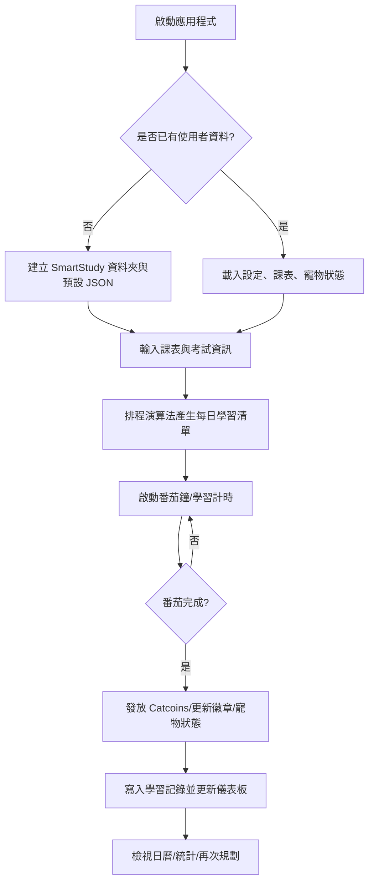

# SmartStudy：智慧學習排程與動機增強系統（Python GUI）

SmartStudy 是一個結合「自動學習規劃」「番茄鐘」「進度視覺化」與「遊戲化/虛擬寵物」的 Python 桌面應用程式。專為備考高壓期的學生打造，透過演算法排程與情緒化回饋，協助建立持續、有效率且具成就感的學習習慣。

> 研究/報告摘要（節錄與改寫自專題 PDF）  
> 高教學習情境中，時間分配與動機維持是關鍵。SmartStudy 以 Python 與 GUI 為基礎，整合自動規劃、彈性時間管理與遊戲化動機機制。最新版支援自訂番茄鐘、視覺化學習歷史、成就徽章、以及寵物客製化，將學習轉化為連續、可視化且具回饋的日常。


## 特色與功能總覽

- 自動學習計畫產生：依「考試期限」「科目重要度」與「既有紀錄」動態產出每日學習清單，避免臨時抱佛腳與過度疲勞。
- 自訂番茄鐘（Pomodoro）：可調整專注/休息時長，支援科目標記與完成提示音。
- 進度視覺化：提供日曆與長條圖 Dashboard，快速回顧每日/每科目學習時數與趨勢。
- 遊戲化激勵：完成學習/番茄可獲得 Catcoins，搭配即時回饋視窗與成就徽章，強化內在動機。
- 虛擬寵物：學習行為會轉換為寵物心情、等級與配件；支援預設或自訂寵物圖像（例如自家貓咪）。
- 跨模組同步：學習完成會即時更新寵物狀態、徽章解鎖與學習日曆。


## 系統模組（資料皆以 JSON 序列化並本機儲存）

- 課表輸入：輸入平日/時段/科目，儲存成結構化 JSON。
- 考試資訊：收集科目、日期與優先度，提供排程演算法的依據。
- 排程演算法：根據迫切性與約束條件分配每日學習任務，變更資料即時重算。
- 番茄計時器：可自訂時長與科目標記，提供開始/停止/休息提醒與音效。
- 鬧鐘：依科目與時間自訂提醒。
- 學習機會檢視：顯示近期待讀科目與各科累積學習時間。
- 進度紀錄/視覺化：以 matplotlib 呈現日曆、長條圖，支援匯出圖片。
- 遊戲化：追蹤 Catcoins、里程碑徽章與回饋彈窗。
- 寵物模擬：以心情、XP、等級反映學習一致性，支援自訂寵物圖片。


## 技術與套件

- GUI：`tkinter`（內建）＋ `ttkthemes`（美化主題）
- 影像：`Pillow`（載入/縮放與合成表情）
- 網路/解碼：`requests`、`io.BytesIO`、`base64`（下載並解碼徽章/貼圖）
- 視覺化：`matplotlib`（日曆、長條圖 Dashboard）
- 資料處理：`pandas`、`numpy`
- 音效：Windows `winsound`（內建）或 `pygame`（跨平台選擇）
- 其他：`json` 進階處理（pretty-print、原子更新）、`calendar`、`time`

> 註：`tkinter` 與 `winsound` 為 Python/Windows 內建模組，無須額外安裝；若於 Linux/macOS 使用，請確保作業系統已安裝對應的 Tk。  
> 依賴套件可透過 `requirements.txt` 一鍵安裝。


## 安裝與環境需求

### 需求
- Python 3.10+（建議 64-bit）
- Windows 10/11（原生支援音效）或其他支援 Tk 的作業系統

### 安裝步驟
1. 下載或 Clone 專案原始碼。
2. 安裝依賴：
   ```bash
   pip install -r requirements.txt
   ```
3. Windows 以外平台：若啟動 GUI 失敗，請先安裝 OS 對應的 Tk（例如 Ubuntu: `sudo apt install python3-tk`）。


## 快速開始

```bash
python smartstudy10.py
```

啟動後可分頁操作：
- 輸入/更新課表與考試期限
- 產生每日學習清單並啟動番茄鐘
- 完成後獲得 Catcoins、更新徽章與寵物狀態
- 於 Dashboard 檢視日曆與統計圖表


## 使用流程圖（Mermaid）




## 資料儲存與 JSON 綱要（示意）

- `SmartStudy/`（自動建立）
  - `settings.json`：使用者設定（自訂番茄時長、主題、音效）
  - `schedule.json`：課表與考試資訊
  - `progress.json`：學習紀錄彙整（每次番茄/學習時數）
  - `badges.json`：徽章進度與解鎖時間
  - `pet.json`：寵物心情、XP、等級與外觀

> 以上屬於示意命名；實際欄位以程式內部序列化為準。


## 常見問題（FAQ）

- GUI 無法啟動：請確認已安裝 Tk（Windows 內建；Linux/macOS 需另行安裝）。
- 音效無聲：Windows 預設使用 `winsound`；其他平台可改用 `pygame`。
- 字體/縮放問題：可調整作業系統 DPI 或在程式偏好設定中調整字體大小。
- 自訂寵物圖片：請使用常見格式（PNG/JPG），過大圖片會由 `Pillow` 自動縮放。


## 發展路線圖（Roadmap）

- 社群/協作：學習小組、共享儀表板、團隊挑戰與排行榜、鼓勵訊息。
- 情緒/健康：HRV（心率變異）回饋、心情檢核、呼吸/正念短暫休息模組。
- 寵物動態：依心情/表現改變互動風格，並解鎖更多外觀與配件。
- 移動端/同步：行動 App、雲端備份與多裝置同步。


## 參考文獻（節錄）

1. M. Hamari, J. Koivisto, H. Sarsa, “Does Gamification Work? – A Literature Review...,” HICSS, 2014.
2. M. Alsawaier, “The Effect of Gamification on Motivation and Engagement,” IJILT, 2018.
3. S. A. Usman, “Using the Pomodoro Technique®...,” Ph.D. dissertation, 2020.
4. M. Deterding et al., “From Game Design Elements to Gamefulness...,” MindTrek, 2011.
5. C. C.Y. Liao et al., “Game-Based ... Virtual Pets,” CSCL, 2009.
6. Y. Wang, Y. Zhang, “Emotionally Driven Virtual Pet Games...,” 2023.
7. K. Seaborn, D. I. Fels, “Gamification in Theory and Action,” IJHCS, 2015.
8. F. Cirillo, The Pomodoro Technique, 1992.
9. T. Cummings, “The Pomodoro Technique: Is It Right For You?”, NYTimes, 2009.
10. Y. Chou, “The Pet Companion Design in Gamification,” 線上文章。


## 致謝（Acknowledgment）

感謝台大林澤宇老師於 Python 課程中的指導與鼓勵，促成本專題之完成與延伸實作。


## 授權

課程專題原始碼與文件僅供學術與個人學習用途。若需轉作商業或散布用途，請先徵得作者同意。


## 專案連結

- GitHub（空白倉庫，已建立）：https://github.com/yinfengyinfeng0624/python-smartstudy


